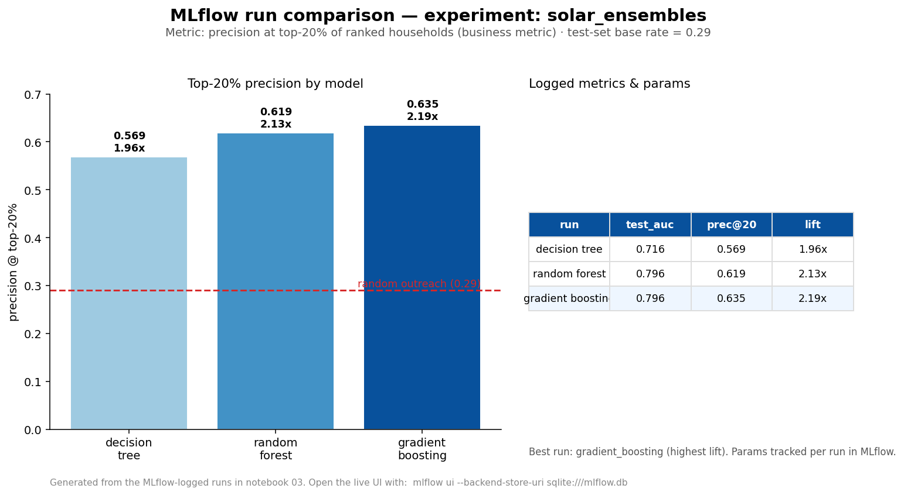

# Powering the Last Mile: Targeting Off-Grid Solar Customers in Nigeria

Ranking Nigerian households by willingness to pay for solar devices — so a pay-as-you-go solar company can spend its outreach budget where conversion is most likely. Built on World Bank Multi-Tier Framework (MTF) survey microdata, including its embedded randomized-price experiment.

## Headline Result

Evaluated on a held-out test set by **precision at the top 20%** of model-ranked households — the metric that matches the deployment decision ("which fifth of households should a vendor contact?"). Random-outreach base rate: **29.0%**.

| Targeting strategy | Top-20% conversion | Lift vs. random |
|---|---|---|
| Random outreach | 29.0% | 1.0× |
| Single decision tree (notebook 02) | 56.9% | 1.96× |
| Random forest | 61.9% | 2.13× |
| **Gradient boosting (best)** | **63.5%** | **2.19×** |

**The best model more than doubles the productivity of every unit of outreach budget.** The gain from one tree to the ensemble comes from a systematic feature harvest and boosting.



## The Problem

Off-grid solar companies and electrification programs in Nigeria face expensive last-mile customer acquisition: field visits cost real money, and most contacted households don't convert. This project builds a ranking model that identifies which unelectrified and under-electrified households are most likely to purchase a solar device if reached.

## The Data

**Nigeria Multi-Tier Framework (MTF) Energy Access Survey, 2018** — World Bank/ESMAP household survey covering 3,669 households in North-West Nigeria, distributed as per-section Stata files with full codebook and questionnaires.

- Source: [World Bank Microdata Catalog](https://microdata.worldbank.org/index.php/catalog/3865)
- Raw data is **not redistributed** in this repository; the ingestion notebook documents how to obtain and extract it.

A notable design feature: the survey embedded a **randomized willingness-to-pay experiment** — each household was offered a solar device at a randomly selected price. This gives the price variable experimentally grounded predictive power and gives the model a demand-curve interpretation.

## Method

1. **Target definition.** Willingness to pay upfront for a solar device at the randomly offered price (`E_3`; 29% positive). Current solar ownership was rejected as a target: at 1.2% prevalence it is both severely imbalanced and mismatched with the business question (a vendor seeks *future* adopters, not current owners).
2. **Systematic feature harvest.** Every eligible MTF variable is screened against an explicit rule — knowable before outreach, not downstream of the target (a strict leakage test that excludes the Section E price-bargaining follow-ups `E_4`–`E_7`), and mechanistically plausible — then the ensemble ranks them and prunes by evidence. The full decision record is in [`Feature_Harvest_Plan.md`](Feature_Harvest_Plan.md). Final matrix: 32 candidate features over 3,625 households, with row-count assertions after every merge to protect the unit of analysis.
3. **Culturally grounded recoding.** Education codes include Quranic schooling — the most common category in this Northern sample, and not a rung on the formal-education ladder. It is modeled as a separate indicator alongside an ordered formal-education band (none / primary / secondary / post-secondary).
4. **Models & tuning.** Decision tree, random forest, and gradient boosting, each tuned with 5-fold `GridSearchCV` on ROC-AUC. Every run is tracked in **MLflow** (SQLite backend); model selection is by precision-at-top-20%.
5. **Honest importance.** Drivers are read with **permutation importance** on the held-out set (importances on wide, correlated feature sets can mislead), and features are pruned only when both near-zero and without business rationale.

## Key Drivers of Willingness to Pay

Permutation importance (drop in test ROC-AUC when shuffled) for the gradient-boosting model:

| Feature | Importance |
|---|---|
| Offered price (randomized) | 0.106 |
| State (geography) | 0.040 |
| Household asset count | 0.036 |
| Number of rooms | 0.021 |
| Total consumption (income proxy) | 0.019 |

Price dominates, as the embedded experiment guarantees. The features that lift the ensemble *beyond* the single tree are wealth and location proxies surfaced by the harvest. Notably, an intuitive hypothesis — that **fuel-lighting spend** would signal latent solar demand — was tested and **found near-zero** in this sample: a documented negative result, not a quiet omission.

## Repository Structure

```
notebooks/
  01_data_ingestion.ipynb                Download, extraction, and first-look validation
  02_target_and_first_tree.ipynb         Target definition, feature engineering, tuned tree, top-20% evaluation
  03_feature_harvest_and_ensembles.ipynb Systematic harvest, tree vs. forest vs. boosting, MLflow, permutation importance
Feature_Harvest_Plan.md                  Feature screening decision record (enumerate -> screen -> prune)
mlflow_run_comparison.png                Model run comparison (portfolio evidence of experiment tracking)
requirements.txt                         Pinned dependencies
raw_data/                                (local only — see ingestion notebook)
```

## How to Run

```bash
git clone https://github.com/ProfFausat/solar-targeting-Nigeria
cd solar-targeting-Nigeria
python -m venv solar
solar\Scripts\activate        # Windows
pip install -r requirements.txt
```

Then run the notebooks in order (Restart Kernel → Run All). Notebook 01 downloads and extracts the survey data; notebooks 02 and 03 are fully reproducible top-to-bottom. Notebook 03 logs to MLflow — inspect the runs with `mlflow ui --backend-store-uri sqlite:///mlflow.db`.

## Roadmap

**Done**
- Single decision tree with top-20% evaluation (notebook 02)
- Systematic feature harvest, ensemble comparison (random forest, gradient boosting), and MLflow experiment tracking (notebook 03)

**Next**
- Deploy the winning model as a batch-scoring service (household CSV in → ranked contact list out), containerised with Docker
- Fairness diagnostics across gender and urban/rural segments
- Two-page client-style targeting brief

## Author

**Fausat M. Ibrahim** — Data Scientist
[LinkedIn](https://www.linkedin.com/in/ibrahimfm) | [GitHub](https://github.com/ProfFausat)
